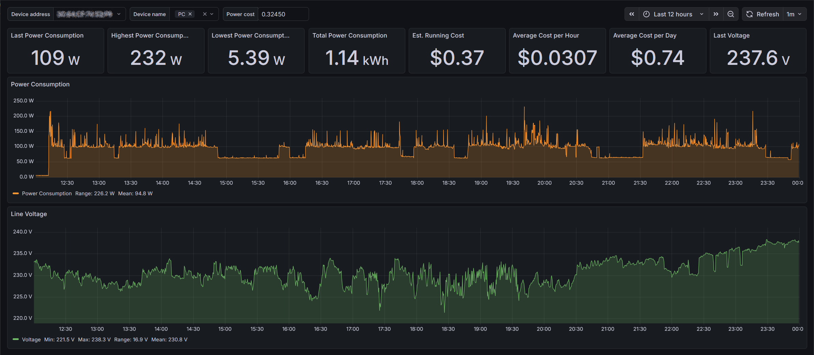

# An Interactive Grafana Dashboard and Energy Monitoring Smart Plug Logger for TP-Link Tapo and Kasa🔌📊

Real-time and long-term energy monitoring dashboard using Grafana, InfluxDB, and Python. Fast and simple deployment using Docker Compose.  Immediate data population and visibility.

Automatic discovery and and energy usage logging for supported TP-Link Tapo and Kasa energy monitoring smart plugs on your local network using [python-kasa](https://github.com/python-kasa/python-kasa).

### Example screenshot 🖼️

### Key functions and features ⚡
 -  **Fully automated deployment** using Docker Compose, real-time statistics visible immediately
 -  **Grafana dashboard** pre-configured with the following real-time and long-term metrics:
	 -  **Power Usage (W):** 
		 - Histogram plot
		 - Numerical readouts for last, highest, lowest, range, mean and total usage
	 -  **Voltage (V):** 
		 - Histogram plot 
		 - Numerical readouts for last, highest, lowest, range, and mean voltage
	 -  **Running Cost ($):** 
		 - Average cost per hour/day, estimated total cost 
 -  **Filter data by MAC and time window**, and optionally device name (as configured in Tapo app)
 -  **Real-time statistics** with instant and projected costs based on trends of the selected time window
 -  **InfluxDB v2 back-end** time-series optimised database providing hugely efficient storage and indexing; low storage requirements and SQL-like querying
 -  **Automatic device discovery, querying and logging** using [python-kasa](https://github.com/python-kasa/python-kasa) and [influxdb-client-python](https://github.com/influxdata/influxdb-client-python)
 -  **Set and forget** with new devices appearing automatically and years of data retention, even on limited storage
 -  **Low resource consumption** means you can run it on super constrained hardware such as Raspberry Pi 3

### Power profiling examples and use cases 📈
- Observe and identify specific device power consumption trends over time
- Understand duty cycles and determine efficient running modes
- Identify inefficient appliances and quantify standby power usage
- Track ongoing running costs of specific devices
- Extrapolate hourly and daily running cost estimates from selected time window
- Monitor seasonal or time-of-day usage patterns

### Requirements 🔧
- **Linux host (x86 or ARM)**: Including Raspberry Pi. Windows is not supported; python-kasa requires host networking mode for broadcast discovery, which isn't available under WSL.

- **Docker Engine:** If not already installed, follow the platform-relevant install instructions here: https://docs.docker.com/engine/install/

- **Docker user permissions:** Ensure your user is added to the docker group (log out/in for changes to take effect):

      sudo groupadd docker
      sudo usermod -aG docker $USER
  
- **Supported TP-Link smart plug(s):** One or more Tapo P110 and/or Kasa HS110.  Other energy-monitoring models may work but are untested.
 
- **Third-Party Compatibility enabled in Tapo app:** In the Tapo app, open the account (“Me”) page, navigate to “Third-Party Services”, and ensure that “Third-Party Compatibility” is enabled.

### Secrets and authentication 🔑
There are six files under `/secrets` that can be updated; these contain placeholder values only.  These are only required when you run `docker compose` and can be deleted once the container has been fully deployed.  Recreate them should you need to re-deploy the container.

InfluxDB's token format is undocumented but appears to accept a [base64](https://base64.guru/learn/base64-characters) string (except using _ and - instead of / and +) up to 88 characters long.  Keep the stock token for testing or update if running long-term.  If you update the token, it must also be updated in `/provisioning/datasources/influxdb.yaml`.

### Quick start 🚀
Check the [Requirements](#requirements-) section and ensure that these are met before proceeding.
  
Clone the repository to your device:

    git clone https://github.com/cjastone/tplink-powerdash.git

Update contents of `/secrets` if you're not deploying for short-term testing only.

Deploy the container:

    docker compose up -d

Deployment time varies; should be under 30 seconds with relatively modern hardware and a fast connection to pull the images, or up to several minutes on heavily constrained hardware. 

Once docker compose is finished, wait a few moments for services to start.  Optionally watch for issues via `docker logs -f telemetry-logger`. Initial errors while services are initialising are expected; it will keep retrying until the database exists.

If all went to plan, you should be able to browse to Grafana at `http://your.docker.host:3000`  and log in using the credentials previously configured under `/secrets`.  Data should be visible immediately.

### Troubleshooting 🤔
Running `docker logs -f telemetry-logger` is your best start - this will give information on database connectivity (especially on first run) as well as device discovery and readings.

Database connectivity issues are visible in Grafana under Connections > Datasources > influxdb-v2 > Test.

Please feel free to report any issues encountered.
